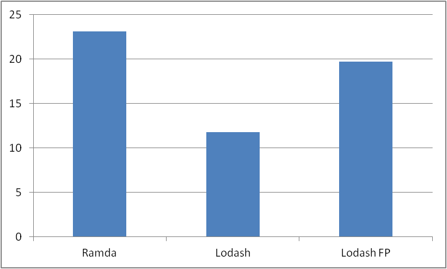

# Librerías para programación funcional en javascript
---
Se van a revisar algunas de las principales librerías de programación funcional
para javascript, para cada libreria se mostrarán los mismo ejemplos, con el fin de resaltar las diferencias y similitudes en la sintaxis y alcance de las librerias.


## [Ramda.js: ](http://ramdajs.com/)
Al igual que la mayoría de las librerias revisadas, Ramda provee una [lista de funciones](http://ramdajs.com/0.22.1/docs/) que pueden ser utilizadas,a diferencia de otras librerías, Ramda está pensada en escribir codigo completamente funcional, manteniendo el foco en funciones libres de efectos secundarios que aseguren inmutabilidad.   
Las funciones provistas por Ramda están todas currificadas por defecto y se separan en las categorías: Math, Function, List, Logic, Object, Relation, String y Type.


#### 1. Instalación

```sh
npm install --save ramda
```

```javascript
const R = require 'ramda'
```

#### 2. Ejemplos
Currying básico de una función, es importante notar que se puede elegir la posición del argumento que recibirá la función devuelta.
```javascript
let curriedSum = R.curry((a,b,c) => -a+b+c);
curriedSum(2,2)(4); // => 4
curriedSum(R.__,2,2)(4) // => 0
```

El orden de los argumentos sí importa, en el siguiente ejemplo, primero se le pasa el nombre de la propiedad a la función get, dado que es una función currificada, esto va a devolver una función que recibe el segundo argumento de la función original, por lo tanto, si se invierte el orden esto dejaría de funcionar.

```javascript
let objects = [{prop: 1}, {prop: 'uno'}, {prop: '1'}];
let get = R.curry((property, object) => object[property]);
objects.map(get('prop')); // => [ 1, 'uno', '1' ]
```


Una ventaja de Ramda es que sus funciones además de estar currificadas, siempre reciben como argumento primero el callback, lo que permite hacer algo como esto:

```javascript
const where = R.where({
  type: R.equals('fire'),
  name: R.complement(R.equals('Charmander')),
  cp: R.gt(R.__, 50),
  hp: R.lt(R.__, 100)
});

const arr = [ {type:  'fire',   name: 'Magmar',     cp: 754,  hp :119},
              {type:  'water',  name: 'Squirtle',   cp: 11,   hp: 19},
              {type:  'fire',   name: 'Charmander', cp: 95,   hp: 99},
              {type:  'fire',   name: 'Magmar',     cp: 955,  hp :90}];      

const filter = R.filter(where)
filter(arr) // => [ { type: 'fire', name: 'Magmar', cp: 955, hp: 90 } ]
```


## [Lodash:](https://lodash.com/)

#### 1. Instalación

```sh
npm install --save lodash
```

```javascript
const _ = require('lodash');
```

#### 2. Ejemplos
Currying básico de una función:
```javascript
const curriedSum = _.curry((a, b, c) => -a + b + c);
console.log(curriedSum(2, 2)(4)); // => 4
console.log(curriedSum(_, 2, 2)(4)); // => 0
```


A diferencia de ramda, lo-dash no recibe el callback como primer argumento, lo cual provoca que el código sea menos elegante:
```javascript
const where = _.conforms({
  type: _.curry(_.isEqual)('fire'),
  name: _.negate(_.curry(_.isEqual)('Charmander')),
  cp: _.curry(_.gt)(_, 50),
  hp: _.curry(_.lt)(_, 100),
});

const filter = _.curry(_.filter)(_, where);
console.log(filter(arr));
```


### [Lodash FP:](https://github.com/lodash/lodash/wiki/FP-Guide)
<<<<<<< HEAD
El módulo `lodash/fp` es una instancia de Lodash más amigable con la programación funcional, con características similares a Ramda. Sus funciones están currificadas, y en los argumentos, los iteradores están al principio y los datos al final, volviendo a hacer el ejemplo del filtro para objetos queda:

```javascript
const fp = require('lodash/fp');
```

```javascript
const where = fp.conforms({
  type: fp.isEqual('fire'),
  name: fp.negate(fp.isEqual('Charmander')),
  cp: fp.gt(fp.__, 50),
  hp: fp.lt(fp.__, 100),
});

const filter = fp.filter(where);
console.log(filter(arr));
```


## [Lazy.js:](http://danieltao.com/lazy.js/)

Es una librería para escribir código que se evalua cuando es necesario (lazy), de manera funcional.

#### 1. Instalación

```sh
npm install --save lazy.js
```

```javascript
const _ = require('lazy.js');
```

#### 2. Ejemplos

Si tenemos un libro completo en un string, y queremos obtener sus tres primeros párrafos, se puede hacer directamente así:
```javascript
const threeParagraphs = book.split('\n').slice(0,3);
```
Aunque es fácil de escribir, el rendimiento es malo porque se recorre el libro completo buscando cambios de línea. Se podría hacer un `for` que recorra caracter por caracter y vaya tomando substrings, pero eso es programación imperativa.

En cambio, usando Lazy.js, se puede hacer:
```javascript
const threeParagraphs = Lazy(book).split('\n').take(3);
```

Esta técnica es aplicable a arreglos, strings y streams.

Otra aplicación es generar secuencias. Por ejemplo, para obtener 300 números aleatoreos entre 1 y 1000, pero únicos entre ellos:

```javascript
const uniqueRandoms = Lazy.generate(Math.random)
  .map((r) => Math.floor(r * 1000) + 1)
  .uniq()
  .take(300);
```
La gracia es que al obtenerlos con `uniqueRandoms.each(...)` se van generando cuando se necesitan, sin tener que calcularlos todos al principio.


## Performance
Para medir cual de las librerías es más eficiente, utilizamos el ejemplo de filtro, para filtrar un arreglo de 10.000.0000 de pokemones. Los resultados fueron los siguientes:




## Referencias:
* http://ramdajs.com/0.22.1/docs/
* http://fr.umio.us/why-ramda/
* https://github.com/lodash/lodash/wiki/FP-Guide
* https://lodash.com/
* http://danieltao.com/lazy.js/
